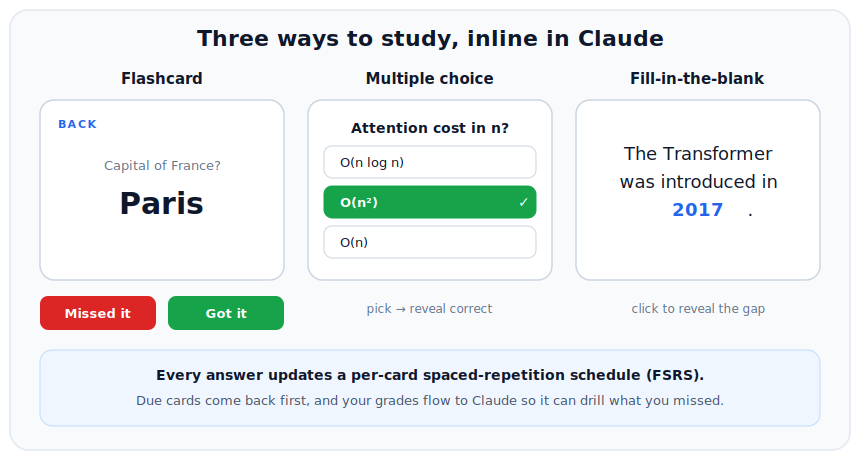
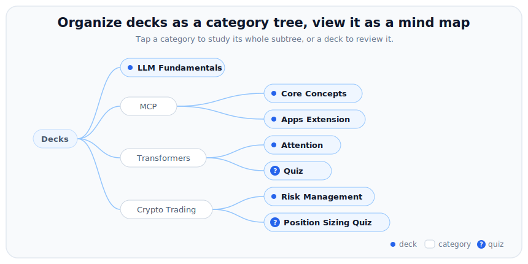

# Memora MCP

[](LICENSE)
[-orange)](https://github.com/modelcontextprotocol/ext-apps)
[](https://www.typescriptlang.org/)
[](https://react.dev/)

Turn any conversation into an interactive study session, right inside Claude Desktop. Ask Claude to make a deck and it generates the cards, then renders them as an inline review you can click through: flip **flashcards**, answer **multiple-choice quizzes**, and fill in **cloze** blanks. Every answer updates a **spaced-repetition** schedule, and your results flow back to Claude so it can drill what you missed.

Keywords: Model Context Protocol, MCP server, MCP Apps, Claude Desktop, flashcards, quizzes, spaced repetition, SRS, FSRS, Anki alternative.

Built on the [MCP Apps extension](https://github.com/modelcontextprotocol/ext-apps) (SEP-1865): core MCP spec `2025-11-25` plus the Apps extension `2026-01-26`.



## Features

**Three ways to study**, all rendered inline and all graded the same way:

- **Flashcards**: click to flip, then grade **Got it** / **Missed it**.
- **Multiple-choice quizzes**: pick an option and the correct/wrong answers reveal instantly.
- **Cloze (fill-in-the-blank)**: the blank reveals in place so the sentence stays intact. Write a blank as `[...]` in a card front and it becomes a cloze card automatically.

**Spaced repetition**: every grade updates a per-card **FSRS** schedule (via [`ts-fsrs`](https://github.com/open-spaced-repetition/ts-fsrs)), so weak cards resurface sooner and due cards come first. Ask *"what's due today?"* for a summary across all your decks.

**Organize with categories**: name decks with `::` to nest them (e.g. `LLM::Attention`). Browse the **category tree**, or the same tree as an interactive **mind map**, and **study** a whole branch in one merged session. Quiz decks are flagged with a badge.

**Manage your decks**: create, append to, edit, rename, and delete decks and cards without leaving the chat. Pass `reverse` when creating a deck to also drill each card back-to-front (handy for vocabulary).

**Just JSON**: decks live in `data/decks.json`, read live on every call. Hand-edit them or let Claude build them. No database, no external service.



## The tools

| Tool | What it does |
| --- | --- |
| `review_deck` | Open one deck for review (due cards first). |
| `study` | Review a whole category subtree, merged into one session. |
| `create_deck` | Generate flashcards or cloze cards; `reverse` also adds back-to-front cards. |
| `create_quiz` | Generate multiple-choice questions. |
| `grade_card` | Record a review result and update the card's FSRS schedule (called by the UI). |
| `due_today` | Summarize what is due across all decks. |
| `edit_card` | Change a card's front and/or back. |
| `rename_deck` | Rename a deck (also moves it in the category tree). |
| `delete_card` | Remove a single card. |
| `delete_deck` | Remove a whole deck. |

Card generation follows Memora's quality rules (atomic single-concept cards, 1-5 word answers, active recall, unambiguous), based on Wozniak's *20 Rules of Formulating Knowledge*.

## How it works (MCP Apps)

A tool declares a `ui://` resource. When Claude calls the tool, the host (Claude Desktop) fetches that resource, renders its HTML in a **sandboxed iframe**, passes the tool result to the UI, and the UI talks back to the host over JSON-RPC (to grade cards and report progress to the model).


## Quick start

### Prerequisites

- Node.js 20.11+

### Connect to Claude Desktop

Open **Settings > Developer > Edit Config** and add Memora under `mcpServers`:

```json
{
  "mcpServers": {
    "memora": {
      "command": "npx",
      "args": ["-y", "@servation/memora-mcp", "--stdio"]
    }
  }
}
```

Then fully quit Claude Desktop (from the system tray) and relaunch. `memora` appears under Settings > Developer, pre-loaded with a few sample decks.

Your decks are stored in `~/.memora/decks.json` (override the path with the `MEMORA_DECKS` environment variable). Hand-edit that file or let Claude manage it.

<details>
<summary><b>Run from source instead</b></summary>

```bash
git clone https://github.com/Servation/memora-mcp.git
cd memora-mcp
npm install
npm run build
```

Point the config at the built entry with an absolute path (decks then live in the repo's `data/decks.json`):

```json
{
  "mcpServers": {
    "memora": {
      "command": "node",
      "args": ["C:\\path\\to\\memora-mcp\\dist\\main.js", "--stdio"]
    }
  }
}
```
</details>

### Try it (in a Claude Desktop chat)

- `review my World Capitals deck`
- `make me a deck of 10 Spanish travel phrases`
- `make a reversible deck of 10 Spanish words` (drills both directions)
- `make a fill-in-the-blank deck about the water cycle` (cloze cards)
- `quiz me with 10 multiple-choice questions on the solar system`
- `turn what we just discussed into a deck called "Photosynthesis"`
- `study my LLM category`
- `what's due today?`

## Tech stack

- **Server**: TypeScript, [`@modelcontextprotocol/sdk`](https://www.npmjs.com/package/@modelcontextprotocol/sdk) plus [`@modelcontextprotocol/ext-apps`](https://www.npmjs.com/package/@modelcontextprotocol/ext-apps), stdio transport (Streamable HTTP also available).
- **UI**: React plus Vite, bundled to a single inlined HTML file via `vite-plugin-singlefile`.
- **Scheduling**: [`ts-fsrs`](https://github.com/open-spaced-repetition/ts-fsrs) (FSRS).
- Runtime is plain `node` once built (no bun or tsx needed).

## Deck format

```json
{
  "Deck Name": [
    { "front": "Capital of France?", "back": "Paris" }
  ]
}
```

- Stored in `~/.memora/decks.json` when installed (or `data/decks.json` from source); override with `MEMORA_DECKS`.
- Read live (mtime-cached). `create_deck`, `create_quiz`, and `grade_card` write here atomically.
- A **quiz** card adds `"options": ["...", "..."]`; its `back` is the correct option.
- A **cloze** card writes the blank as `[...]` in the front, with the hidden term as the `back`.
- Cards gain a `due` date and an FSRS `srs` block as you review them; cards without them are treated as new.
- Keep it valid JSON, or the server falls back to a built-in default deck.

## Project structure

```
memora-mcp/
├── server.ts            # MCP tools + the ui:// resource
├── decks.ts             # data model, decks.json storage, result builder
├── scheduling.ts        # FSRS scheduling + review ordering
├── main.ts              # entry: stdio (Claude Desktop) or Streamable HTTP
├── mcp-app.html         # UI entry HTML (bundled by Vite)
├── src/
│   ├── mcp-app.tsx      # review orchestrator (flip / quiz / cloze, grade -> model)
│   ├── deck-lib.tsx     # tree, mind map, card list, quiz/cloze views, helpers
│   ├── mcp-app.module.css
│   └── global.css       # host theme variable fallbacks (light/dark)
├── data/decks.json      # editable decks, read live
├── media/               # README images
├── vite.config.ts       # single-file bundle config
└── tsconfig*.json
```

## Development

```bash
npm run dev        # vite watch (UI) plus tsx server on http://localhost:3001/mcp
npm run typecheck  # tsc --noEmit
```

For fast local iteration you can also run the app against the MCP Apps reference host (`basic-host`) from the [ext-apps repo](https://github.com/modelcontextprotocol/ext-apps).

## Roadmap

See [TODO.md](TODO.md) for the backlog: npm + MCP Registry publishing, cross-client hosting (Streamable HTTP), tests around parsing and scheduling, and a real screen-capture demo GIF.

## License

[MIT](LICENSE)
