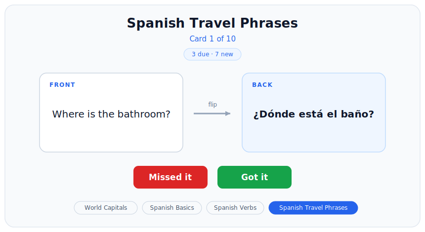
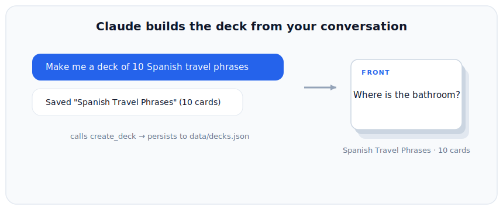
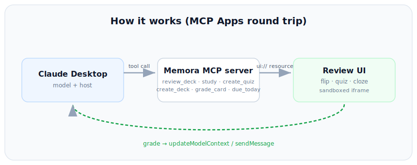

# Memora MCP

[](LICENSE)
[-orange)](https://github.com/modelcontextprotocol/ext-apps)
[](https://www.typescriptlang.org/)
[](https://react.dev/)

An interactive flashcard **MCP App** for Claude Desktop. Claude generates flashcards from your request or the conversation and renders them as an inline, gradeable **flip-card** review with **spaced repetition**. Your grades flow back to the model, so Claude can react to your score and offer to drill what you missed.

Keywords: Model Context Protocol, MCP server, MCP Apps, Claude Desktop, flashcards, spaced repetition, SRS, Anki alternative.

Built on the [MCP Apps extension](https://github.com/modelcontextprotocol/ext-apps) (SEP-1865): core MCP spec `2025-11-25` plus the Apps extension `2026-01-26`.



## What it does

- **`review_deck`**: opens a deck as an inline flip-card UI. Click to flip, grade **Got it** / **Missed it**, see a results screen. Due cards come first, and grades are sent back to the model via the host bridge.
- **`create_deck`**: Claude generates cards from your request or the chat, saves them to `data/decks.json`, and renders them immediately. They persist, so `review_deck` can replay them later. Generation follows Memora's card-quality rules (atomic single-concept cards, 1-5 word answers, active-recall or cloze prompts, unambiguous).
- **`grade_card`** (spaced repetition): each grade persists a per-card schedule (due date, interval, ease, reps) using a simple SM-2-style algorithm, so weak cards resurface sooner.
- **Deck picker**: switch between your decks from buttons in the UI, no retyping in chat.
- Decks are plain JSON read **live** on every call, so you can hand-edit them or let Claude create them. No database, no external service.



## How it works (MCP Apps)

A tool declares a `ui://` resource. When Claude calls the tool, the host (Claude Desktop) fetches that resource and renders its HTML in a **sandboxed iframe**, passes the tool result to the UI, and the UI talks back to the host over JSON-RPC.



## Tech stack

- **Server**: TypeScript, [`@modelcontextprotocol/sdk`](https://www.npmjs.com/package/@modelcontextprotocol/sdk) plus [`@modelcontextprotocol/ext-apps`](https://www.npmjs.com/package/@modelcontextprotocol/ext-apps), stdio transport.
- **UI**: React plus Vite, bundled to a single inlined HTML file via `vite-plugin-singlefile`.
- Runtime is plain `node` (no bun or tsx needed) once built.

## Prerequisites

- Node.js 20+

## Setup

```bash
npm install
npm run build      # builds the UI bundle (dist/mcp-app.html) and compiles the server (dist/)
```

## Connect to Claude Desktop

Open **Settings > Developer > Edit Config** and add (use the absolute path to this folder):

```json
{
  "mcpServers": {
    "memora": {
      "command": "node",
      "args": ["C:\\path\\to\\memora-mcp\\dist\\main.js", "--stdio"]
    }
  }
}
```

Then fully quit Claude Desktop (from the system tray) and relaunch. `memora` should appear under Settings > Developer.

## Usage (in a Claude Desktop chat)

- `review my World Capitals deck`
- `make me a deck of 10 Spanish travel phrases`
- `turn what we just discussed into a deck called "Photosynthesis"`
- `add 5 harder capitals to my World Capitals deck`  (uses `append`)

## Development

```bash
npm run dev        # vite watch (UI) plus tsx server on http://localhost:3001/mcp
npm run typecheck  # tsc --noEmit (UI)
```

For fast local iteration you can also run the app against the MCP Apps reference host (`basic-host`) from the [ext-apps repo](https://github.com/modelcontextprotocol/ext-apps).

## Deck format (`data/decks.json`)

```json
{
  "Deck Name": [
    { "front": "question", "back": "answer" }
  ]
}
```

Read live (mtime-cached). `create_deck` and `grade_card` write here atomically. Cards gain optional spaced-repetition fields (`due`, `interval`, `ease`, `reps`) as you review them; cards without them are treated as new. Keep it valid JSON, or the server falls back to a built-in default deck.

## Project structure

```
memora-mcp/
├── server.ts            # MCP server: review_deck + create_deck + grade_card + ui:// resource
├── main.ts              # entry: stdio (Claude Desktop) or Streamable HTTP transport
├── mcp-app.html         # UI entry HTML (bundled by vite)
├── src/
│   ├── mcp-app.tsx      # React flip-card UI, deck picker, grade -> model bridge
│   ├── mcp-app.module.css
│   └── global.css       # host theme variable fallbacks (light/dark)
├── data/decks.json      # editable decks, read live
├── media/flip-card.svg  # README image
├── vite.config.ts       # single-file bundle config
└── tsconfig*.json
```

## Roadmap

See [TODO.md](TODO.md) for the full backlog: inline card editing, deck management tools, a fuller FSRS scheduler, npm + MCP Registry publishing, cross-client hosting, and a real demo GIF.

## License

[MIT](LICENSE)
